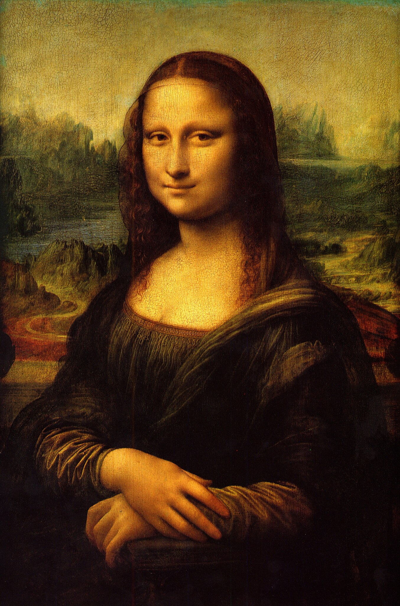

# 🎨 Neural Style Transfer App using VGG19 + Streamlit

This project is a neural style transfer implementation using PyTorch and the pre-trained VGG19 model. It lets you blend the content of one image (e.g., *Mona Lisa*) with the artistic style of another (e.g., a Picasso painting). The entire experience is built with an interactive **Streamlit GUI**.

---

## 🖼 Example

<table>
<tr>
<td><br><b>Content Image</b></td>
<td><br><b>Style Image</b></td>
<td><br><b>Stylized Result</b></td>
</tr>
</table>

<div align="center">
  <br>
  <i>Sample Streamlit GUI</i>
</div>

---

## 🚀 Features

- Style transfer using VGG19 features
- Gram matrix-based style representation
- Adjustable content/style weights
- Iterative progress preview
- Intermediate step images grid
- Final image download button
- GUI made with Streamlit

---

## 🧠 How It Works

The model extracts features from a **content image** and a **style image**, then optimizes a **target image** to minimize:

- **Content loss**: similarity to content features
- **Style loss**: similarity to style features (via Gram matrices)

---

## 🧰 Built With

- [Python](https://www.python.org/)
- [PyTorch](https://pytorch.org/)
- [Torchvision](https://pytorch.org/vision/)
- [Streamlit](https://streamlit.io/)
- [Pillow](https://python-pillow.org/)

---

## 🛠️ Installation

Make sure you have Python ≥ 3.8 installed.

```
git clone https://github.com/your-username/style-transfer-app.git
cd style-transfer-app
pip install -r requirements.txt

```
<details> <summary><code>requirements.txt</code> sample</summary>
nginx
Copy
Edit
torch
torchvision
streamlit
Pillow
</details>

## ▶️ How to Run
```
streamlit run main.py
```

Upload a content image and a style image in the sidebar.

Adjust:

> Content weight (alpha)

> Style weight (beta)

> Number of optimization steps

> Sit back and watch as the style is transferred in real-time!

> Download the final stylized image.

## 🧩 TODOs & Enhancements
 > Add multiple predefined style options

 > Save session history

 > Style blend toggle (multiple styles)

 > Dark mode theme for Streamlit

 > Mobile responsiveness

## 📄 License
This project is licensed under the MIT License – free for personal or commercial use with attribution.

## 👤 Author
Swarupa Balaji
